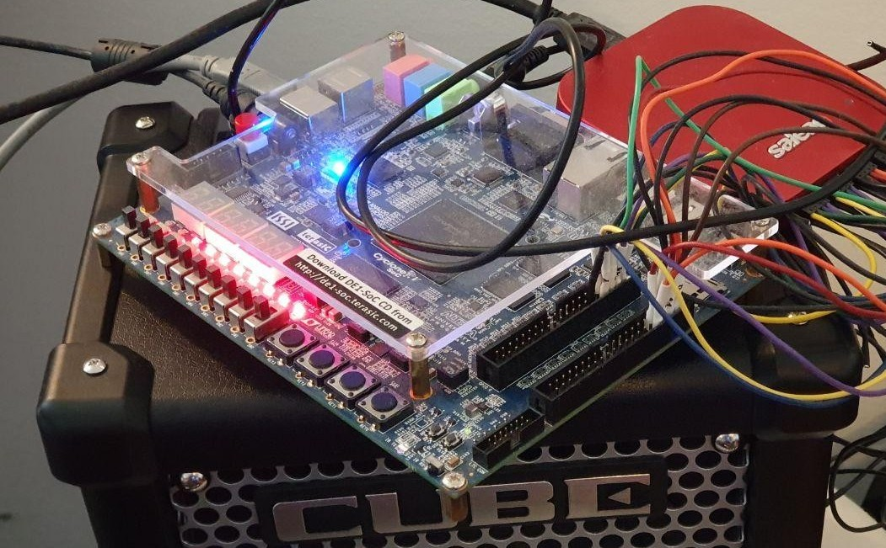

# FPGA sound synthesizer

A digital sound synthesizer platform on FPGA and associated full-stack toolchain written in VHDL, C, Python and NodeJS. The system is implemented on the Altera Cyclone V FPGA fabric of the Terasic DE1-SoC development kit board.

The project includes the softcore system design and control software, Python meta-scripts for scalable and configurable generation of its VHDL code, a compact low-level music abstraction library in C to represent a subset of the MIDI protocol as composable macros, and a MIDI file parser written in NodeJS to translate existing MIDI files to the C representation.

The technical report can be found in [report/AlexandreChau_LoicDroz_FPGASoundSynthesizer.pdf](report/AlexandreChau_LoicDroz_FPGASoundSynthesizer.pdf)  
The demo video and slides can be found at the following Google Docs link: [https://go.epfl.ch/fpga-sound-synthesizer-slides](https://go.epfl.ch/fpga-sound-synthesizer-slides)



The current softcore design includes 16 oscillators (allowing up to 16-voices polyphony), each able to generate sawtooth, square or triangle waves for the note range A0 (27.5 Hz) to C8 (4186 Hz) by digitally computing real-time pulse-code modulation samples at a rate of 96 KHz and 32-bit depth. The sound generation unit interprets a subset of the MIDI protocol through messages on an Avalon bus, sent by a softcore NIOS II processor. The system offers playback, volume and tone selection controls through the physical switches and buttons of the board, and provides real-time visual feedback by implementing a VU-meter approximation on the LEDs.

## Setup and structure

#### To run the FPGA sound synthesizer design on the Terasic DE1-SoC board:

- You will need a DE1-SoC development kit board, Quartus (Lite or Standard edition, 15.1 to 19.1) with Nios II Software Build Tools for Eclipse
- Open the [`src/hw/de1soc_sound_synthesizer.qpf`](src/hw/de1soc_sound_synthesizer.qpf) project file with Quartus
- Run the [`src/hw/quartus/pin_assignment_DE1_SoC.tcl`](src/hw/quartus/pin_assignment_DE1_SoC.tcl) script through Tools > Tcl scripts
- Connect your DE1-SoC device and launch the Quartus Programmer. Find the device in the hardware setup, and if the programming chain is not loaded automatically, hit "Auto Detect" and select 5CSEMA5F31 if prompted. Change its file to [`src/hw/output_files/de1soc_sound_synthesizer.sof`](src/hw/output_files/de1soc_sound_synthesizer.sof), check the "Program/Configure" box and hit "Start", which should program the DE1-SoC Altera Cyclone V FPGA core with the softcore design
- Open Tools > Nios II Software Build Tools for Eclipse and select File > Import > Nios II Software Build Tools Project / Import Nios II Software Build Tools Project. Fill "Project location" with the path to [`src/sw/nios/application`](src/sw/nios/application) and name it `fpga_sound_synthesizer`.
- Perform the same step as above for the BSP project with path [`src/sw/nios/fpga_sound_synthesizer_bsp`](src/sw/nios/fpga_sound_synthesizer_bsp) and name `fpga_sound_synthesizer_bsp`
- Compile the software with Project > Build All. If the build fails, right-click on the `fpga_sound_synthesizer_bsp` project and hit Nios II > Generate BSP. Then, Build All projects again.
- Create a new Nios II Hardware run configuration with the corresponding project name and ELF binary. In Target Connection, make sure to select your Nios II processor, check "Ignore mismatched system ID", "Ignore mismatched system timestamp", "Download ELF to selected target system", "Start processor" and **uncheck** "Reset the selected target system" (known to cause ELF download failed errors with this project).
- Run the program and profit! You can edit the song selection in [`src/sw/nios/application/music.h`](src/sw/nios/application/music.h) by replacing the `pieces` array and includes above with the code snippets in other music header files.

#### To change architectural parameters and regenerate VHDL files for compilation:

- You will need GNU Make and Python 3.
- Change your working directory to [`src/hw/hdl`](src/hw/hdl).
- Edit the parameters at the top of the [`src/hw/hdl/sound_gen.py`](src/hw/hdl/sound_gen.py) file to your liking (make sure to read the [technical report]((report/AlexandreChau_LoicDroz_FPGASoundSynthesizer.pdf)) for the specification).
- Run `make` in the [`src/hw/hdl`](src/hw/hdl) folder. The VHDL files should now be freshly regenerated and ready to be compiled.

#### To use the MIDI parser tool to convert a MIDI file into a C header file

- You will need NodeJS (>= 12.18.1) and a single-track MIDI file
- Change your working directory to [`midi-parser/`](midi-parser/)
- Run `npm install` (only once) to fetch the required dependencies
- Usage is `node parse <MIDI file path> <C variable name> [Transpose shift (ex. -1)] [Duration scaling factor (ex: 0.8)]`. Make sure to read the [technical report]((report/AlexandreChau_LoicDroz_FPGASoundSynthesizer.pdf)) for limitations and advanced usage.
- You should now have a generated `.h` file in the `midi-parser` folder, which can be included in [`src/sw/nios/application/music.h`](src/sw/nios/application/music.h).
- The MIDI parser tool only supports single-track MIDI files and may not be robust to unexpected messages, read the [technical report]((report/AlexandreChau_LoicDroz_FPGASoundSynthesizer.pdf)) for more details. The parser was successfully tested with MIDI exported from single-track Bitwig projects.

## Authors and license

- Alexandre CHAU ([@dialexo](https://github.com/dialexo)) \<alexandre.chau@alumni.epfl.ch\>
- Loïc DROZ ([@Scrashdown](https://github.com/Scrashdown)) \<loic.droz@alumni.epfl.ch\>

#### Acknowledgements

- MidiParser.js library ([https://github.com/colxi/midi-parser-js](https://github.com/colxi/midi-parser-js))
- Sahand Kashani-Akhavan ([@sahandKashani](https://github.com/sahandkashani)) for the top-level VHDL file and pin assignment
- René Beuchat ([https://people.epfl.ch/rene.beuchat](https://people.epfl.ch/rene.beuchat?lang=en))
- Jonathan Scanzi ([@jonscanzi](https://github.com/jonscanzi))

This project is licensed under the GNU Affero General Public License v3.0. See the [LICENSE](LICENSE) file for more information.

```
FPGA sound synthesizer
Copyright (C) 2020 Alexandre CHAU, Loïc DROZ

This program is free software: you can redistribute it and/or modify
it under the terms of the GNU Affero General Public License as published
by the Free Software Foundation, either version 3 of the License, or
(at your option) any later version.

This program is distributed in the hope that it will be useful,
but WITHOUT ANY WARRANTY; without even the implied warranty of
MERCHANTABILITY or FITNESS FOR A PARTICULAR PURPOSE.  See the
GNU Affero General Public License for more details.

You should have received a copy of the GNU Affero General Public License
along with this program. If not, see <https://www.gnu.org/licenses/>.
```