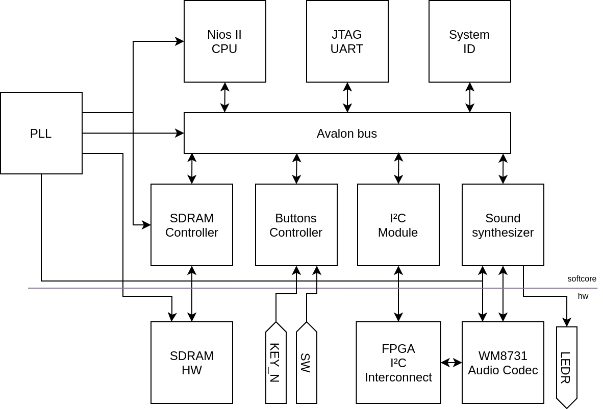
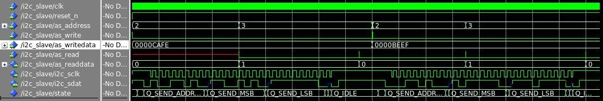
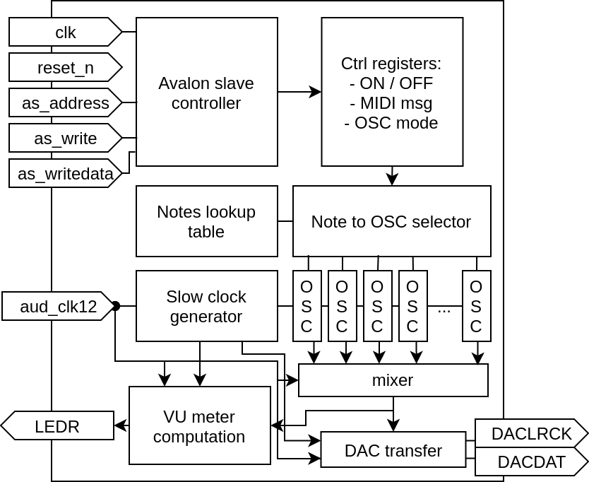
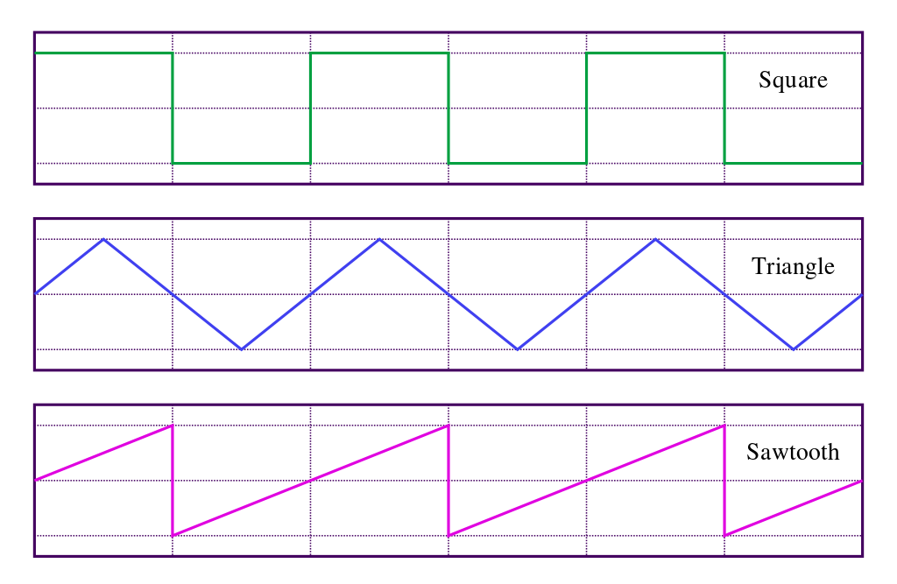
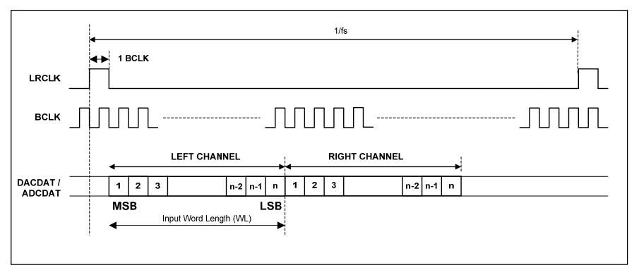
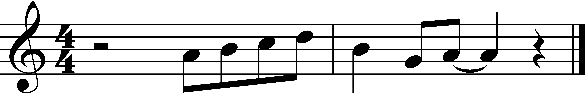
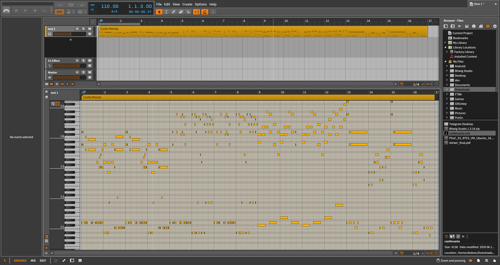

---
header-includes:

 - \usepackage{fancyhdr}
 - \usepackage{multicol}
 - \pagestyle{fancy}
 - \fancyhead[CO,CE]{FPGA Sound Synthesizer}
 - \fancyfoot[CO,CE]{Alexandre CHAU, Loïc DROZ - \today}
 - \fancyfoot[LE,RO]{\thepage}
 - \newcommand{\columnsbegin}{\begin{multicols*}{2}}
 - \newcommand{\columnsend}{\end{multicols*}}
---

\title{FPGA Sound Synthesizer}
\author{Real-time Embedded Systems}
\date{Alexandre CHAU, Loïc DROZ\\\today}
\maketitle

# Abstract

Electronic sound synthesis has revolutionized the way music and noises are made by bringing new soundscapes and procedural techniques to explore. Analog and digital synthesizers paved the way to modern sound design, affecting many fields such as music production, movie and video game making, advertising and the entertainment industry. They were core to the emergence of new genres of music and enabled the democratization of its process, allowing nowadays anyone with a laptop to craft professional quality audio.

In this project, we implement a digital sound synthesizer on the Altera FPGA of the Terasic DE1-SoC development board, which produces music through the headphone jack connector of the WM8731 hardware audio codec. The current softcore design includes 16 oscillators (allowing up to 16-voices polyphony), each able to generate sawtooth, square or triangle waves for the note range A0 (27.5 Hz) to C8 (4186 Hz) by digitally computing real-time pulse-code modulation samples at a rate of 96 KHz and 32-bit depth. The sound generation unit interprets a subset of the MIDI protocol through messages on an Avalon bus, sent by a softcore NIOS II processor. The system offers playback, volume and tone selection controls through the physical switches and buttons of the board, and provides real-time visual feedback by implementing a VU-meter approximation on the LEDs.

{#id .class width=400px #fig:board}

The VHDL code is made scalable through meta-generation in Python, which allows the project to be easily ported to different devices by simply specifying parameters such as sample rate, depth and number of instantiated oscillators. The software running on the NIOS II processor also defines a compact low-level music abstraction library in C to represent the MIDI messages subset and to compose music programmatically, while a MIDI parser written in NodeJS is also made available to easily convert MIDI files into this representation.

# Overview

In the following sections we will describe the design of the FPGA sound synthesizer and its associated full-stack toolchain along 4 contributions:

1. **Sound synthesis core**: the hardware sound synthesizer softcore system as programmed on the Terasic DE1-SoC Altera FPGA and synthesized from VHDL code. It reads music pieces description from SDRAM, generates a digital audio signal which is then fed to the WM8731 audio codec of the board for digital-to-analog (DAC) conversion.

2. **VHDL code generation**: Python scripts that dynamically generate the VHDL code of the synthesizer, based on parameters such as number of available LEDs, DAC sample rate, number of spawned oscillators, etc. which allow quick, simple and (in principle) bug-free modification of architectural parameters of the synthesizer.

3. **Music abstraction library**: a low-level C library implementing macros and data structures derived from the MIDI protocol. It allows programmers to describe music pieces in C code which is understood and translated into sound by the synthesizer. Used by the main program running on the NIOS II CPU.

4. **MIDI parser**: a NodeJS command-line application that extracts notes from a MIDI file and assembles them into a music piece in a C header file, expressed using the aforementioned C music abstraction library format. It also implements optional octave shifts and tempo changes.

# Specification

The FPGA sound synthesizer system should comply with the following functional requirements:

- **Music output through the headphone jack**: the output signal can be consumed through the physical 3.5mm headphone jack connector (in green) of the DE1-SoC board, for instance by connecting off-the-shelf earphones or loudspeakers. To do so, the system must write pulse-code modulation (PCM) samples to the digital-to-analog converter (DAC) of the hardware WM8731 audio codec chip using the I$^2$S protocol on its dedicated pins exposed to the FPGA fabric.

- **Configuration of the WM8731 audio codec**: the WM8731 device must be configured before usage (to activate and power the interface, enable the DAC, set clock settings, route audio signals, etc.) with the I$^2$C protocol on the shared I$^2$C bus of the DE1-SoC. Ideally, the configuration should be done in software for flexibility and decoupling.

- **Generation of several basic shapes of sound waves**: the sound synthesizer can produce audio waves of frequencies mapped to the range of notes A0 (27.5 Hz) to C8 (4186 Hz). The system is able to generate as many oscillators (denoted $N$) as the underlying FPGA resources allow, which are mixed together through PCM sample addition (the system ensures that the sum of all maximum oscillator values does not exceed the sample depth of the DAC). Thus, $N$-notes polyphony is possible and the system implements an algorithm to allocate and free oscillators with concurrent notes. If the polyphony exceeds $N$, the sound synthesizer ignores the latest notes. Each oscillator can produce audio signals of shape sawtooth wave, square wave or triangle wave. All oscillators produce the same kind of wave shape at the same time.

- **Playback of multiple songs** (without changes to the memory content): once running, the system can autonomously and indefinitely play a selection of preloaded songs in memory without additional communication with the development computer. Ideally, the songs in memory can be easily swapped in-between runs through software.

- **Subset of MIDI protocol**: the sound synthesizer system stores, reads and interprets a subset of the MIDI protocol to represent and perform music. It understands the following MIDI event semantics:
	- The most significant byte (MSB) represents the event delta time, relative to the last previous MIDI event expressed in ticks (tick value is arbitrary and can be configured through a MIDI message). This value is transformed in the system into millisecond delta times and stored in a separate word (otherwise it would cap at 255 ms). **The sound generation unit is not made aware of these delta times**: another unit must wait and dispatch the events to it at the appropriate time to emulate the behavior of a live instrument.
	- The second MSB represents the event type, the system will only consider note start (0x90) and note stop (0x80) events and ignore all others. However, **since non-note events are discarded, translations from standard MIDI must carefully recompute the delta times such that they aggregate all non-note event values between each pair of note events**.
	- The third byte of a MIDI note event represents the note (frequency) itself. The range of notes A0 (27.5 Hz) to C8 (4186 Hz) corresponds to MIDI note codes 0x15 - 0x6C (reference A4 at 440Hz is 0x45).
	- The least significant byte (LSB) represents the note velocity and is unused yet but reserved for future implementation.
	- The project provides a command line interface (CLI) program (which requires the NodeJS runtime environment) which takes as input single-track MIDI files which describe songs and outputs C header files with the C representation of the MIDI protocol subset previously defined. It also implements octave transposition and tempo scaling. The MIDI parser was successfully tested with MIDI exported from single-track Bitwig projects.

- **Human-computer interface**: end-users can interact with the sound synthesis system through the buttons, switches and LEDs of the DE1-SoC board. The user can see real-time feedback of the moving average amplitude of the signal with a VU-meter on the `LEDR` lights of the DE1-SoC. For user input, the unsigned representation of the `SW` switch defines the interaction mode, which selects the effects of the `KEY_N` button presses (indices 3 down to 1, respectively from leftmost to second from right):
	- Mode 0, playback controls: mute audio, restart current song, play next song
	- Mode 1, volume controls: volume down, volume up, volume reset to default
	- Mode 2, sound wave selection: sawtooth wave, square wave, triangle wave
	- Rightmost `KEY_N` button (index 0) always hard-resets the whole softcore system

- **Code scalability and reuse**: parts of the softcore system code is generated through Python scripts which automatically recompute and rewrite VHDL files (including widths and ranges of wires and registers, instantiation of registers, components and logic, sample-periodicity of note oscillators, lookup tables and various derivations). This allows the project to be portable (scalable to the size of the FPGA, number of LEDs) and reconfigurable (variable DAC settings). The programmer can specify the DAC sampling rate (currently 96 KHz), sample depth (32 bits), the number of physical LEDs (10), the frequency of the PLL clock (12 MHz) from which is derived the sampling clock (must be a multiple!) and the number of desired oscillator instances (16).

# System design

## Architecture

The design is centered around an Avalon bus and is defined using Platform Designer (QSys) in `src/hw/quartus/system.qsys`. Each functionality has an associated slave, each packaged as an IP component (TCL scripts in `src/hw/quartus/`). The system is governed by a master NIOS II CPU through messages on the Avalon interconnect, which can be programmed and debugged through a (USB) JTAG connection using the Nios II Software Build Tools for Eclipse. The system is instantiated and connected to the physical pins in the top level file `src/hw/hdl/DE1_SoC_top_level_sdram.vhd`, and the pin assignment is provided by Sahand Kashani-Akhavan in `src/hw/quartus/pin_assignment_DE1_SoC.tcl`. The following sections describe the implementation of each module individually.

{#id .class width=500px #fig:synth_block}

The system includes and configures the following modules:

- **Clock and reset_n inputs**: connected to the FPGA 50 MHz master clock and the `KEY_N[0]` button respectively

- **PLL Intel FPGA IP**: derives 4 clocks from the 50 MHz clock:
	- 50 MHz clock forwarded to Avalon slaves except the SDRAM controller
	- 100 MHz clock connected to the NIOS II CPU and the SDRAM controller
	- 100 MHz clock with -3758ps phase shift exported to the SDRAM CLK hardware input
	- 12 MHz audio clock which feeds the WM8731 clock inputs and from which is derived the 96 KHz slow clock for audio processing)

- **SDRAM Controller Intel FPGA IP**: used as instruction and data memory for the NIOS II CPU and exports the SDRAM `wire` connections to control the memory hardware. It stores music data as defined in the C music abstraction library format and the C software binary that controls the system.

- **Nios II Processor (full)**: with 4KB instruction cache, 2KB data cache, reset and exception vectors set to SDRAM memory. It reads notes data and playback instructions from SDRAM, drives the I$^2$C slave for configuration and sends MIDI note information to the sound synthesizer module. It also receives interrupt requests (IRQ) from the buttons controller and the JTAG UART.

- **JTAG UART Intel FPGA IP & System ID Peripheral Intel FPGA IP**: used for debugging, software verification and JTAG communication by Nios II Software Build Tools for Eclipse. Left to default settings.

- **I$^2$C slave**: a custom I$^2$C Avalon slave module used to interface with the I$^2$C bus of the DE1-SoC. It exports I$^2$C wires SCLK and SDAT.

- **Buttons controller slave**: a custom Avalon slave that detects human interactions with the physical controls of the board (`SW` switch and `KEY_N` buttons 1 to 3) and then sends interrupt requests to the Nios II CPU. It exports a 10-bits wide input switch bus and a 3-bits wide buttons bus.

- **Sound synthesizer slave (`sound_gen`)**: a custom Avalon slave that handles all audio processing and sound generation logic. It receives MIDI note inputs and configuration settings from the Avalon write interface. It also takes back as input the 12 MHz audio clock input, and outputs samples transfers to the WM8731 DAC with I$^2$S through the AUD_DACLRCK and AUD_DACDAT pins. It also outputs a VU-meter to the exported LED output.

### Top-level instantiation

The file `src/hw/hdl/DE1_SoC_top_level_sdram.vhd` is set as top-level entity of the project (the pin assignment script `src/hw/quartus/pin_assignment_DE1_SoC.tcl` must be ran once before compilation). The architecture defines a `clk12` signal, connected to the exported PLL 12 MHz clock. It feeds `AUD_BCLK` and `AUD_XCK` clock inputs of the WM8731 device directly, as it will be configured in USB mode (which allows it to derive any internal timing from a master 12 MHz clock input), as well as the sound synthesizer audio clock input `sound_gen_0_audio.aud_clk12`. In the component instance port map, the master `clk` is connected to the `CLOCK_50` 50 MHz FPGA clock, `reset_n` to `KEY_N[0]` (as both inputs are negated, a button down press will effectively enable the reset), all SDRAM wires are connected to their respective `DRAM_*` pins. I$^2$C slave outputs `i2c_sclk` and `i2c_sdat` are connected to the DE1-SoC I$^2$C interconnect pins `FPGA_I2C_SCLK` and `FPGA_I2C_SDAT`. The sound generation slave is connected to the I$^2$S DAC pins of the WM8731 `AUD_DACLRCK` and `AUD_DACDAT`, the `vu_meter` output is connected to `LEDR`, and finally the buttons controllers `switch` and `buttons` inputs are connected to `SW` and `KEY_N(3 downto 1)` respectively.

## Meta-generation of VHDL code

The sound synthesizer capabilities are configurable through dynamic code generation (requires Python 3 and GNU Make). This meta-programming is achieved through usage of Python's multi-line format strings and built-in `math` library. Running `make` in folder `src/hw/hdl/` will generate all VHDL files dependent on parameters specified in `src/hw/hdl/sound_gen.py` (Make targets are defined in the associated `src/hw/hdl/Makefile`).

In `sound_gen.py`, the following variables at the top of the file can be tweaked:

- `DAC_FREQ`: the sample rate of the DAC in Hz (default: 96000). Affects the frequency of the audio slow clock generation in `sound_gen.vhd`, the speed of I$^2$S transfers and the sample-periods and linear sample differences values of the notes lookup table in `linear_diff.vhd`. The script does not update the associated I$^2$C configuration of the WM8731 DAC interface, which must be manually changed in the C software (`src/sw/application/nios/peripherals.c:setup_audio_codec`).

- `DAC_DEPTH`: the sample depth (precision) of the DAC in number of bits (default: 32). Affects the size of generated audio samples, the size of I$^2$S transfers and the sample-periods and linear sample differences values of the notes lookup table in `linear_diff.vhd`. The script does not update the associated I$^2$C configuration of the WM8731 DAC interface, which must be manually changed in the C software (`src/sw/application/nios/peripherals.c:setup_audio_codec`).

- `N_OSC`: the number of desired oscillator instances (default: 16). The only constraints on this number are the physical constraints of the FPGA (available resources, timings). Affects the number of registers and oscillator components and logic in `sound_gen.vhd`, the max / min value of each oscillator in `osc.py` and the linear sample differences values of the notes lookup table in `linear_diff.vhd`.

- `PLL_CLOCK_FREQ`: the frequency of the PLL clock from which is derived the audio slow clock (default: 12000000, **must be a multiple of DAC_FREQ**).

- `LED_LEN`: the number of LEDs used to display the VU-meter (default: 10).

- `VU_METER_INV_DECAY_LOG2`: $log_2$ of the inverse of the decay factor used for exponential smoothing for the VU-meter, i.e. $n$ if the decay factor $\alpha = 1 / 2^n$ (default: $n = 2$, must have $n \geq 0$).

The script then derives other values such as the max / min signed sample value (resp. $2^{depth_{DAC} - 1} - 1$ and $-2^{depth_{DAC} - 1}$), and constrains each oscillator output to $(max - min) / N_{osc}$ and $-(max - min) / N_{osc}$

## I$^2$C Avalon slave

The I$^2$C Avalon slave component serves as an intermediary between the CPU and the WM8731 audio codec for configuration. It receives an 8-bit I$^2$C address (7-bit + LSb = 0 for I$^2$C write) and a 16-bit message from the CPU through its exposed registers, and sends them to the WM8731 audio codec using the I$^2$C protocol. It also exports a status register which indicates if an I$^2$C transfer is currently ongoing. The CPU polls it to know when it can initiate a new I$^2$C transfer. Messages are always 16 bits long because the WM8731 audio codec expects a 7-bit internal register address followed a 9-bit value to write, totaling 16 bits, which the component sends in two 8-bit chunks, as per the I$^2$C protocol.

### Register map

| **Offset (bytes)** | **Name**          | **Direction** | **Length** | **Description**                                                             |
| :----------------: | ----------------- | :-----------: | ---------- | --------------------------------------------------------------------------- |
|         0          | **`i2c_address`** |       W       | 8 bits     | I$^2$C address of the recipient slave, **including LSB = 0 (I$^2$C write)** |
|         4          | **`i2c_data`**    |       W       | 16 bits    | 16-bit I$^2$C message to be sent to the slave                               |
|         8          | **`start`**       |       W       | -          | Writing any value initiates the I$^2$C transfer                             |
|         12         | **`busy`**        |       R       | 1 bit      | Reads 1 if an I$^2$C transfer ongoing, 0 otherwise                          |

*Note: the DE1-SoC board datasheet and schematic state that the I$^2$C address of the WM8731 audio codec is "0x34 (write-only)". Our design uses `0x34` on 8 bits as being the actual I$^2$C address already appended with LSb = 0, which corresponds to write mode. The DE1-SoC exposes the I$^2$C bus to the FPGA fabric by default.*

### Ports

As it is an Avalon slave exporting readable and writable registers, its ports feature the `as_address`, `as_write`, `as_writedata`, `as_read` and `as_readdata` signals. As it is an I$^2$C master, it also exports the I$^2$C clock and data lines, which we name respectively `i2c_sclk` and `i2c_sdat` (note that `i2c_sdat` is an in/out as it must be read and written to). Finally, it also takes the main clock and reset signals as inputs.

```VHDL
entity i2c_slave is
    port (
        clk     : in std_logic;
        reset_n : in std_logic;

        -- Avalon
        as_address   : in std_logic_vector(1 downto 0);
        as_write     : in std_logic;
        as_writedata : in std_logic_vector(31 downto 0);
        as_read      : in std_logic;
        as_readdata  : out std_logic_vector(31 downto 0);

        -- I2C
        i2c_sclk : out std_logic;
        i2c_sdat : inout std_logic
    );
end entity i2c_slave;
```

### Implementation

Our component consists of a slow clock generator and an FSM process (Fig. @fig:i2c_fsm). The slow clock generator produces the 200 KHz I$^2$C clock, along with two pulses, `high_en` and `low_en`, which signal respectively the midpoints of the I$^2$C clock's high and low intervals. The FSM then uses these two pulses to send the address and data over the I$^2$C bus and check for acknowledgments at the appropriate times.

The FSM starts in the idle state, where it keeps the I$^2$C clock and data lines up. When the internal register `busy` is on (set by a write to the `start` register), we trigger the I$^2$C start condition by setting the data line low. We then send the 7 bits of the I$^2$C address and the R/W bit by setting the data line when `low_en` is up, which ensures the current bit to be sent will be on the data line in the next high interval of the I$^2$C clock. When the last bit is sent, we release the data line and check for an acknowledgement on the next I$^2$C clock high interval (when `high_en` is up). If there is an acknowledgment, we proceed by sending the 8-bit packets of data in the same way. Otherwise, we keep the I$^2$C clock up and go back to the idle state.

When the last bit of the last byte of data is acknowledged, we keep the I$^2$C clock up, set the register `busy` to 0 making the device available for a new transfer, and go back to the idle state. Entering the idle state pulls the I$^2$C data line up, thus triggering the I$^2$C clock stop condition.

{ #id .class width=500px #fig:i2c_fsm }

### Simulation

We then simulate our design in Modelsim (Fig. @fig:i2c_modelsim) by sending it two transfer requests, the first with I$^2$C address `0x9A` (i.e. `0x4D` + LSB = 0) and data `0xCAFE`, the second with I$^2$C address `0x34` (i.e. `0x1a` + LSB = 0) and data `0xBEEF`.

{ #fig:i2c_modelsim }

In the first transfer, we see the transmitted address is correct (`0b10011010 = 0x9A`) as well as its message (`0b11001010 = 0xCA`, `0b11111110 = 0xFE` $\rightarrow$ `0xCAFE`). Likewise, in the second transfer, the address is correct (`0b00110100 = 0x34`) and so is the message (`0b10111110 = 0xBE`, `0b11101111 = 0xEF` $\rightarrow$ `0xBEEF`).

We also read the `busy` register during and after each transfer, and we get correct values (1 during transfers, 0 otherwise).

### WM8731 configuration

Configuration is performed in several steps, in the following order:

1. Reset and activate the device via registers `0001111` and `0001001`.
2. Activate the DAC, de-activate the ADC (which we don't use), power on Line Out (where we intend to output sound) and power on the whole device via register `0000110`.
3. Select 32-bit DSP slave mode for the digital audio interface format, via register `0000111`. We do this because our synthesizer generates 32-bit samples, alternatively for each channel.
4. Set volume to its default value and set both channels to have the same volume, via register `0000010`. We share the volume between both channels because our synthesizer outputs the same signal on both channels.
5. Select USB mode with 96 KHz DAC sample rate, via register `0001000`. This makes it easy to select the sample rate and we only need to feed two clocks to the device: `MCLK` and `BCLK`, which we set at 12 MHz in our case.
6. Map DAC output to Line Out, via register `0000100`. Line Out is where we expect to get the DAC conversion result.
7. Unmute the DAC, via register `0000101`.

## Buttons controller

The buttons controller interfaces with the board buttons 3-1 and switches. When a button is pressed, it triggers an IRQ and exports a register through which the state of all buttons and switches can be read simultaneously. This allows the main program to not only know which button was pressed, but also the position of the switches in a single read transfer. The main program uses the unsigned representation of the switches positions to define the operation mode of the buttons. Each mode of operation is described in the software section of the report.

### Register map

| **Offset (bytes)** | **Name**     | **Direction** | **Length**  | **Description** |
| :----------------: | ------------ | :-----------: | ----------- | ------------------------------------------------------------------------------------- |
|         0          | **`status`** |       R       | 13 bits     | Returns the activation status of each button and switch. One bit per button/switch. Bits 2 to 0 are for buttons, bits 12 to 3 are for switches. |
|         4          | **`irq`**    |       W       | -           | Writing any value clears the IRQ, if it is currently up.                                                                                        |

\pagebreak

### Implementation

Buttons signals are low-enable, which means we need to detect their falling edges to know when a button has been pressed. However, as these signals are not clocks, we can not use the `falling_edge` function to do this. Instead, we implement our own falling edge detectors, one for each button.

We implement a falling edge detector using two registers, `prevs` and `currs`. At each clock rising edge, we store the value of the button inputs in `currs`, and store the previous value of the button inputs from `currs` into `prevs`. If any matching indices of bits `prevs` and `currs` are respectively set to 1 and 0, this means a falling edge happened between the last clock rising edge and the previous one, at the corresponding button index. We use a `for ... generate` VHDL construct to connect each falling edge detector register bit to each button input. Whenever a falling edge is detected, we trigger an IRQ, and record the state of the buttons and switches in register `status`, which can be read by the CPU through the register map.

## Sound synthesizer

The sound synthesizer slave is the audio sample generation core and is defined in folder `src/hw/hdl/` in file `sound_gen.vhd`, with sub-entities declared in `osc.vhd` and `linear_diff.vhd` (respectively generated from `sound_gen.py`, `osc.py` and `linear_diff.py`). It receives notes and configuration from the Avalon write interface, generates digital audio samples, transfers them to the WM8731 DAC with the I$^2$S protocol and outputs a VU-meter to the board LEDs.

### Register map

| **Offset (bytes)** | **Name**     | **Direction** | **Length**  | **Description** |
| :----------------: | ------------ | :-----------: | ----------- | ------------------------------------------------------------------------------------- |
| 0  | **start**	| W | -		  | A write of any value to this register will enable the device. Notes sent afterwards will be decoded and played by the synthesizer. If notes are currently being played by oscillators, they will be unmuted. |
| 4  | **stop**		| W | -		  | A write of any value to this register will disable the device. Notes currently being played and notes sent afterwards will be muted until a new write to `start`. |
| 8  | **midi_msg**	| W | 32 bits | A write with a 32-bit MIDI message of note start or note stop event to this register will assign (resp. clear) an oscillator to play (halt) the corresponding note. The MIDI message must have the following format: MSB (deltatime) ignored, second MSB (event type) must be either note start (0x90) or note stop (0x80), second LSB (MIDI note code) must be between 0x15 and 0x6C, mapped to the note range A0 (27.5 Hz) to C8 (4186 Hz), LSB (velocity) ignored, reserved for future use. |
| 12 | **osc_mode**	| W | 32 bits | A write with a 32-bit value to this register will configure the operation mode of the oscillators. Currently, the following modes are supported:\newline 0 - selects sawtooth wave generation for all oscillators\newline 1 - selects square wave generation for all oscillators\newline 2 - selects triangle wave generation for all oscillators.\newline Other modes are reserved for future use, they will fallback to mode 0 in the current implementation |

### Structure

The sound synthesizer slave implements the above control registers that are writable by an Avalon master. It subdivides the 12 MHz clock provided by the PLL to drive the 96 KHz slow clock enable used by audio components, so that the sample generation rate matches the DAC frequency and that all audio operations are synchronized. It instantiates all oscillators, the notes lookup table, and 3 registers per oscillator: the linear sample difference register, the sample period register, and the note message register (see [Notes lookup table]).

It implements demultiplexing logic to allocate oscillators to incoming note start events, and to free all matching oscillators of an incoming note stop event. To assign a note to an oscillator, the selection logic provides the note event message, the sample period and the linear sample difference (corresponding to the note frequency from the notes lookup table) to the first oscillator which note register is set to zero, into its dedicated registers. The logic also frees all oscillators which second MSB of their note register equals the second MSB of a note stop event in the `midi_msg` register by setting their dedicated note, sample period and linear sample difference registers to zero. If all oscillators on the system are already playing notes, the sound synthesizer will ignore subsequent note start events until one of the currently played note is stopped. If a note stop event does not match any currently playing oscillator, the event is ignored.

The slave also defines the mixer process, the DAC transfer process, and the VU-meter computation, which implementations are described in the following sections.

{#id .class width=320px #fig:synth_slave}

### Notes lookup table

The notes lookup table defined in `src/hw/hdl/linear_diff.vhd` (generated from `src/hw/hdl/linear_diff.py`) maps the MIDI note code range 0x15 - 0x6C to 2 values each: the note period expressed in samples (i.e. the closest integer number of samples for the time period corresponding to the given note frequency at the DAC sample rate) and the note linear sample difference (or note linear step) expressed in sample value delta (i.e. the linear difference required between each pair of 2 consecutive samples in order to exhaust the minimum-maximum oscillator sample value interval in the note time period, for a given note frequency at the DAC sample rate). The computation is done in the Python script, and it also ensures that the maximum sample value of each oscillator is smaller than the maximum DAC sample value divided by the number of oscillator instances (this makes sure that the final audio sample never saturates or overflows). The equations are defined as follow:

First, the function that converts a MIDI note codes `n` to frequencies is (from [https://www.audiolabs-erlangen.de/resources/MIR/FMP/C1/C1S3_CenterFrequencyMIDI.html](https://www.audiolabs-erlangen.de/resources/MIR/FMP/C1/C1S3_CenterFrequencyMIDI.html)):

$$pitch(n) = A_4 * 2 ^ {(p-69) / 12}$$

where $A_4$ is the reference A4 frequency 440 Hz. Thus the period in sample is computed as:

$$period_{sample}(n) = f_{DAC} / pitch(n)$$

where $f_{DAC}$ is the DAC frequency (96 KHz), the lookup table result is rounded to nearest integer.

The note linear sample difference is:

$$d(n) = \lfloor (M - m) / (N_{osc} * period(n))  \rceil$$

where $M$ and $m$ are respectively the max and min signed value at the DAC depth (32 bits) and $N_{osc}$ the number of oscillator instances.

The python code translates the above formulas and generate one VHDL case per MIDI note code to sample period and linear difference mapping.

### Oscillators

The oscillators are defined by the entity `src/hw/hdl/osc.vhd` (generated from `src/hw/hdl/osc.py`). It computes signed PCM audio samples at the DAC sample rate, and can generate either sawtooth, square or triangle audio wave shapes. It takes as input the 12 MHz clock and the 96 KHz slow clock enable, as well as external (in the sound synthesizer slave) registers values device enable, oscillator mode and per-oscillator registers note MIDI message, note linear sample difference and note sample period. These dedicated registers have been populated by the slave device with the lookup table when a note is assigned to this oscillator. It outputs the sample on `osc_out` which width matches the DAC sample depth.

Each wave shape is produced concurrently, and a final multiplexer driven by the slave `osc_mode` register selects the correct shape onto `osc_out` given the mode identifier. If the device enable register is off or if the note byte of the MIDI message register of this oscillator is zero (i.e. the oscillator is currently free), the zero audio sample is produced.

{#id .class width=280px #fig:pcm_waves}

To generate the different waves, the Python script first defines the max and min value for each oscillator $\pm (M - m) / (N_{osc} * 2)$ where $M$ and $m$ are respectively the max and min signed value at the DAC depth and $N_{osc}$ the number of oscillator instances.

- Square wave: a counter waits until half of the sample period, while the signal is maintained constant at the min value. Then, the signal is flipped to the max value constant during the other half of the sample period. The audio signal thus constantly alternates between min and max at double the note frequency.

- Saw tooth wave: the signal starts at the min value, and increments by the linear sample difference at each sample. When the sample period is reached, the signal abruptly resets to the min value. The linear sample difference provided by the lookup table ensures that the max value is reached at the end of the period.

- Triangle wave: the signal starts at the min value and increments by twice the linear sample difference at each sample. When the half period is reached, the signal should be at the max value. Then, the signal decrements down to the min value by the same amount during the second half period.

Since all multiplications and divisions are by factors of powers of 2, they can be implemented very simply using shifts.

### Mixer

The mixer process in `sound_gen.vhd` is very simple, as combining multiple oscillators simply consists in summing the sample values from all oscillators together. This is similar to the real-world counterpart where two sound sources are close to each other, as a third-party listener will hear the sum of both audio vibrations. Since the oscillators ensure that the sum of all max values does not saturate or overflow the DAC sample depth, the process simply adds the `osc_out` vectors together at a rate of 96 KHz. This happens in a pipeline fashion, where the 32-bit final sample value is copied at the next audio slow clock enable to the left and right channels of the 64-bit `audio` signal, respectively in the higher and lower half of the register. This will then be consumed by the DAC transfer process.

### DAC transfer with I$^2$S

The DAC transfer process is a very simple finite state machine which waits on the 96 KHz slow clock enable to start a new transfer, which is done serially on the I$^2$S interface at 12 MHz. `AUD_DACLRCK` is set in the slow clock generation process to pulse at 96 KHz to signal the start of a new transfer to the WM8731 device, at the same time as the slow clock enable pulse. `AUD_BCLK` is already connected to the 12 MHz clock externally. The WM8731 DAC is configured in DSP/PCM Mode Audio Interface (mode A, LRP=1), so that the 32-bits of the left channel and the 32-bits of the right channel can be sent consecutively, starting one cycle after the `AUD_DACLRCK` pulse.

{#id .class width=550px #fig:wm8731_timing}

Thus, at each audio slow clock pulse at 96 KHz, the transfer process simply iterates through the 64 bits of the `audio` register and outputs them one by one on `AUD_DACDAT` at 12 MHz.

### VU-meter

The VU-meter is a real-time volume indicator displayed on the board's LEDs. While an actual VU-meter has a standardized definition to implement a moving average with set attack and release times, we approximate its behaviour using smoothing, which is computationally less expensive in memory.

Our VU-meter is made up of two parts: a smoothing stage, which takes the absolute value of the audio signal of the synthesizer and smoothes it, and a conversion stage which takes this binary value and converts it to an $n$-bit unary-like representation, where $n$ is the number of LEDs on the board.

**Smoothing**

We use a variety of smoothing called *exponential smoothing*, which is defined by the following formula:

$$v_t = \alpha |s_t| + (1 - \alpha) v_{t-1}$$

where $v_t$ is the volume at sample $t$, $|s_t|$ the absolute value of the signal at sample $t$, and $\alpha \in [0, 1]$ is called the *decay factor*.

The main advantage of this technique is that we only need to store 1 additional sample, versus $n$ if we used a moving average, where $n$ is the width of the moving average window. It is also simple to implement in VHDL. Furthermore, so long as $\alpha = 1 / 2^n$ with $n \in \mathbb{N}$, both multiplications can be approximated using shifts and subtractions. Indeed, $|s_t| \cdot \alpha = |s_t| \cdot 1 / 2^n = |s_t| / 2^n \approx |s_t| \gg_{arith} n$ and $(1 - \alpha) \cdot v_{t-1} = (1 - 1 / 2^n) \cdot v_{t-1} = v_{t-1} - (v_{t-1} / 2^n) \approx v_{t-1} - (v_{t-1} \gg_{arith} n)$.

Unfortunately, this limits the choice of values for the decay factor. Also, as divisions by $2^n$ operate on integers, their result is inevitably truncated which means that $n > \lfloor log_2(|s_t|) \rfloor \rightarrow \alpha |s_t| = 0$, and $n > \lfloor log_2(v_{t-1}) \rfloor \rightarrow (1 - \alpha) v_{t-1} = v_{t-1}$. This could be the cause of another problem: the smoothed value $v_t$ does not always converge to 0 but to 3 once all new samples are 0, probably linked to the fact that divisions are truncated, combined with the recursive nature of the exponential smoothing formula and the way we implement it.

**Binary to unary conversion**

We implement the conversion using a simple logarithmic scale. At sample $t$, we turn on $n_u + 1$ LEDs, where $n_u$ is the smallest integer s.t. $v_t < 2^{n_u}$. We implement this in VHDL using an `if` statement, which is generated using Python.

## Software

Software running on the board consists of the main program, the music abstraction library along with music files, and a small library that handles interactions with the I$^2$C controller and synthesizer peripherals. The main program is in `main.c`, the music abstraction library in `music.h`, music pieces in files `<name>.h` where `name` is the name of the song, and the peripherals library in `peripherals.h` and `peripherals.c`.

### Music abstraction library

Our music abstraction library declares macros for a subset of MIDI events, each note ranging from A0 to C8, structures for individual events and music pieces, and also imports some music files and compiles the music pieces they declare into an array.

An individual event is encoded in the `note` structure containing a MIDI message and its duration in milliseconds, as two 32-bit values.

```C
    /**
     * This structure represents a note event in a music piece
     */
    struct note
    {
        uint32_t midi_msg;
        uint32_t duration_ms;
    };
```

The attribute `note.midi_msg` encodes an event type and note. The LSB representing the note velocity is reserved for future use. MIDI timedeltas MSBs are not directly supported as the time unit depends on a MIDI configuration message sent beforehand, however we translate timedeltas to millisecond waits with our MIDI parser into the `note.duration_ms` field. Each part of the message (encoded by macros) is aligned to its equivalent position in a real MIDI message. Thus the synthesizer expects and directly understands a subset of MIDI messages. We support two MIDI event types: *note start* and *note stop*.

```C
    /**
     * MIDI STATUS BYTES
     * These codes define the action type such as note on and note
     * off. They are already shifted to the correct offset in a
     * MIDI message for painless composition
     */
    #define MIDI_STATUS_BYTES_OFFSET 16
    #define NOTE_STOP 0x80 << MIDI_STATUS_BYTES_OFFSET
    #define NOTE_START 0x90 << MIDI_STATUS_BYTES_OFFSET

    /**
     * MIDI NOTES
     * These definitions map the notes A0 - C8 to the MIDI note
     * codes 21 - 108. They are already shifted to the correct
     * offset in a MIDI message for painless composition
     */
    #define MIDI_NOTE_OFFSET 8
    #define A0 21 << MIDI_NOTE_OFFSET
    #define As0 22 << MIDI_NOTE_OFFSET
    #define B0 23 << MIDI_NOTE_OFFSET
    // ...
    #define C8 108 << MIDI_NOTE_OFFSET

    /**
     * Reserved MIDI definitions
     */
    #define MIDI_VELOCITY_OFFSET 0
    #define MIDI_TIMEDELTA_OFFSET 24
```

A MIDI event can then be created very easily, for example: `{ NOTE_START | A0, 1000 }` encodes a note start event for A0, lasting 1000 ms.

A music piece is then encoded as a structure containing a pointer to an array of notes, along with its length.

```C
    /**
     * This structure represents a music piece
     * Length is given in # of notes
     */
    struct piece
    {
        size_t length;
        struct note *sheet;
    };
```

A complete music piece can then be encoded easily. For example, the short music piece in Fig. @fig:music_piece_sheet translates to the code below (quarter note at 120 bpm):

```C
    #define THE_LICK_LENGTH 14
    struct note the_lick[THE_LICK_LENGTH] = {
        {NOTE_START | A4, 250},
        {NOTE_STOP | A4, 0},
        {NOTE_START | B4, 250},
        {NOTE_STOP | B4, 0},
        {NOTE_START | C5, 250},
        {NOTE_STOP | C5, 0},
        {NOTE_START | D5, 250},
        {NOTE_STOP | D5, 0},
        {NOTE_START | B4, 500},
        {NOTE_STOP | B4, 0},
        {NOTE_START | G4, 250},
        {NOTE_STOP | G4, 0},
        {NOTE_START | A4, 750},
        {NOTE_STOP | A4, 0},
    }
```

{#id .class width=350px #fig:music_piece_sheet }

### Main program

The main program runs on the NIOS II CPU and is responsible for configuring the audio codec, sending note events to the synthesizer at the appropriate times, and handling user interactions through the board's buttons and switches. It maintains an array of music pieces, a pointer to the currently running music piece, an index pointing to the current note within it, a mute flag, and a volume variable, all stored as global variables. As volume change is done by writing the audio codec's volume register via I$^2$C using our I$^2$C controller, the default volume value corresponds to the audio codec's default volume in decibels, as described in its documentation, 0 dB compared to its reference output level.

**Buttons controller ISR**

We first register the ISR for the buttons controller IRQ. The ISR checks which button has been pressed and retrieves the buttons' mode of operation from the state of the switches. It then performs the task assigned to the button that was pressed depending on the mode of operation, and finally clears the IRQ of the buttons controller. The current modes of operation are the following:

| **Switches** | **Button 3**      | **Button 2**          | **Button 1**      |
| ------------ | ----------------- | --------------------- | ----------------- |
| `0000000000` | Toggle mute       | Restart current music | Skip music        |
| `0000000001` | Volume down       | Volume up             | Volume reset      |
| `0000000010` | Use sawtooth wave | Use square wave       | Use triangle wave |

Mute toggle functionality is implemented by toggling the mute flag and writing respectively to the synthesizer's `stop` / `start` registers to mute / unmute the synthesizer, depending on the flag. Restarting the current music is done by stopping the synthesizer, resetting the note cursor to 0, and restarting the synthesizer. Skipping music is done by stopping the synthesizer, incrementing the music pointer to the next music in the array of music pieces, resetting the note cursor to 0 and restarting the synthesizer.

Volume down / up / reset is performed by respectively incrementing the volume variable by 1 dB / decrementing the volume variable by 1 dB / resetting the volume variable to the default value, and setting the new volume in the audio codec via I$^2$C. If decrementing / incrementing the volume would drive it below the audio codec's minimum / over the audio codec's maximum value, we do nothing.

Setting the wave type is done by writing to the synthesizer's `osc_mode` register.

Note that, in all modes of operation, it is possible for two buttons to be pressed at the same time (although extremely unlikely because the two buttons would have to change state during the same Avalon clock cycle, i.e. a 20ns interval). In such a case, button 1 will take precedence over 2 and 3, and button 2 will take precedence over 3. Also, even with its IRQ uncleared, the buttons controller will still record button presses and update its internal register. As such, our ISR will not see the state of buttons and switches at the exact moment the IRQ was triggered, but rather the state at the time it retrieves it via our buttons controller. This interval corresponds to the *Interrupt response time*, plus the time it takes to send the Avalon read request to the buttons controller. It is also very unlikely that 2 buttons could be pressed during that interval, but in case this happens and they were not pressed during the same Avalon clock cycle, only the most recent button press will be seen.

**Audio codec configuration**

We then configure the audio codec via our I$^2$C controller. The configuration we use is explained in [WM8731 configuration]. We have a decicated function called `i2c_configure`, which takes the I$^2$C address of the audio codec (`0x34` on this board, including the LSB as I$^2$C direction bit, see [I$^2$C Avalon slave]), and two bytes of data to be written in one I$^2$C transfer, which the audio codec interprets as the 7-bit address of an internal register, packed with the 9-bit value to be written. Our function sets the I$^2$C address and data in our I$^2$C controller, starts the transfer, and polls the I$^2$C controller's `busy` register until it indicates the transfer is done.

**Event loop and playing music**

Once the ISR has been registered and the audio codec has been configured, we enter the main event loop. We start with no music selected (music pointer is `NULL`), and wait until the user starts playing the current song by using either the skip or restart function. We then play the selected music, and set the music pointer back to `NULL` when the music is finished. We then loop back and wait for user input again, restarting the cycle.

To play the selected music, we first start the synthesizer, turn off mute, and reset the note cursor to 0 (beginning of the song). We then iterate over the notes of the selected song, each time writing the MIDI message to the synthesizer directly, incrementing the note cursor, and waiting for the duration encoded in the current note. When we reach the end of the song, we stop the synthesizer and return.

## MIDI parser

To translate existing music sheets into our C representation, we implement a small parser in Javascript (requires the NodeJS runtime environment >=12.18.1) which takes as input MIDI files and outputs C header files, with all MIDI note events transcribed as note structs composed with the macros API. The program is a command line interface with the following usage:

```bash
    # in working directory midi-parser/
    # run npm install only once to fetch dependencies
    npm install
    node parse <MIDI file> <C variable name> [Transpose shift (ex. -1)] [Duration
    scaling factor (ex: 0.8)]
```

With parameters:

- `MIDI file`: Input MIDI file name
- `C variable name`: name used for output C header file and included variable name
- `Transpose shift`: optional unsigned integer to shift all notes by the specified amount of octaves
- `Duration scaling`: optional float factor to scale the duration of notes.

For now, the MIDI parser only supports single-track MIDI files, which can be obtained by combining all tracks with a digital audio workstation (DAW) beforehand. The MIDI parser was successfully tested with MIDI files exported from single-track Bitwig projects. The output C header files can be included as is in the main C project and its variable added to the songs array.

{#id .class width=500px #fig:bitwig}

The Javascript program uses the `midi-parser-js` library, which translates the binary blobs of the input MIDI file into human-readable JSON objects. It extracts all *note start* and *note stop* events with type 0x90 or 0x80 respectively. It then decodes the MIDI note and transpose it if required (capped to the A0 - C8 range), extracts the MIDI delta time and transforms it into a millisecond value and applies duration scaling. Finally, it generates the appropriate C structures and macros using format strings, into a header file.

The only tricky part of the implementation is the translation of delta times to millisecond values: since we ignore non-note events and delta times in MIDI files are expressed relative to the previous MIDI event of any type, we must aggregate and sum all delta times in-between any pair of MIDI note events. Also, since we implement a live performance style synthesizer, we must compute the duration of the note instead of the time elapsed since the previous one (indeed, a live instrument is not informed in advance of when its player releases a note). Thus, the `findDelta` function elegantly aggregates such values in a lookbehind fashion using functional programming:

```js
    function findDelta(events, index) {
        // must find distance to next note start by aggregating deltaTimes
        // if last (i.e. no note start is found afterwards, it must be 0)
        const eventsLeft = events.slice(index + 1, events.length)
        const nextIndex = eventsLeft.findIndex(e => e.type === NOTE_START_TYPE ||
                                                    e.type === NOTE_STOP_TYPE)
        if (nextIndex === -1) return 0
        else {
            return eventsLeft.slice(0, nextIndex + 1)
                .reduce((acc, curr) => acc + curr.deltaTime, 0)
        }
    }
```

# Conclusion

In this project, we implemented a digital sound synthesizer platform on the Altera FPGA of a Terasic DE1-SoC board, and an associated full-stack toolchain with 4 components: the sound synthesis core as programmable on the device, scalable and reconfigurable VHDL code generation of the sound synthesizer with Python, a low-level music abstraction library implemented in C, and a MIDI parser tool written in NodeJS to convert MIDI files into the C representation.

The FPGA sound generation system produces PCM samples in real-time at 96 KHz sample rate, 32-bit sample depth through the WM8731 audio codec, by interpreting a subset of the MIDI protocol. The system includes 16 oscillators which can output saw, square or triangle waves. Users can interact with the system through physical buttons to control playback, volume and wave shape, and view a real-time VU-meter on the LEDs.

## Limitations and future work

**VU-meter real-time computation**

A possible improvement could be to implement smoothing using a moving average instead of exponential smoothing. Computing the samples' sum with a FIFO would require only one addition, one subtraction, and one division (an arithmetical shift if moving average window size is a power of 2) per new sample (newest sample is added to the sum, oldest subtracted from the sum, i.e. a CIC filter), as the oldest sample can be popped out the FIFO. This would somewhat alleviate the problems of divisions truncated to 0, as the numerator in the operation would be larger than with exponential smoothing. However, unless we use some kind of hardware divider, we would be limited to window sizes of the form $2^n$, as they can be approximated with arithmetical shifts.

Another improvement could be to use the absolute value of the first derivative of the signal ($|\frac{\partial s_t}{\partial t}|$) instead of the signal itself. This stems from the fact that sound waves are essentially roughly periodic *variations* of air pressure (or pressure in some other medium than air) over time, which in our case are caused by the variation of the audio signal we generate, or in other words, when $|\frac{\partial s_t}{\partial t}| > 0$. Therefore, it may make more sense to use that derivative as a measure of volume. Another way to see that would be to imagine a constant signal greater than 0: computing its moving average would always yield non-null volume, despite the fact that such a signal would not generate any sound wave. Alternatively, a sinusoidal signal centered on 0 with massive amplitude and very small period $p$ (much smaller than moving average window $w$, i.e. $p \lll w$) would yield a very small volume if it were computed using its moving average, despite the fact such a signal would generate very loud sound waves.

**GCC compilation issue**

The main software program currently suffers from a compilation issue with GCC: as all music data is stored in global variables through includes, GCC issues the following compilation error when the static data in header files exceeds ~8KB (i.e. when the total length of music pieces exceeds some threshold):

```
    fpga_sound_synthesizer_bsp/HAL/src/alt_instruction_exception_entry.c:95: warning:
    Unable to reach (null) (at 0x0403075c) from the global pointer (at 0x04028160)
    because the offset (34300) is out of the allowed range, -32678 to 32767.
```

As the SDRAM is large enough to hold about 8 million notes (64 MB), the problem probably lies in the binary linker which seems to push the exception vector too far into memory (unreachable through offset-based address arithmetic).

**Sound generation pipeline additional features**

As the system now defines a basic sound generation pipeline with several oscillators and a mixer, as many sound pipeline stages could be then implemented: frequency filters, effects such as delay, reverberation, compression, distortion, equalizer, ..., parameters modulation through envelope generators, LFOs, noise generators, wavetable based oscillators (to implement sine waves for instance), reconfigurable audio path routing, ...

**Interpret live MIDI data from Ethernet or USB port**

Another feature could be to interpret live MIDI data coming from a MIDI instrument or a digital audio workstation through the Ethernet or USB connection of the device. This would require the implementation / usage of a driver to communicate with these protocols (either through the hardware or with a hard processor system running Linux for instance).

**Improve compatibility of MIDI parser**

The MIDI parser can only transform single-track MIDI files and does not handle outliers and unexpected messages well. The code could be improved to support multi-tracks MIDI files and to be more robust.

**Scale system to other FPGAs / audio codecs**

The python scripts allow the code to be resized or reconfigured given the specific hardware platform. The abstraction level of the meta code generation could be raised to accept other FPGA models and audio codec devices. The system could also be re-implemented using a better framework such as MyHDL, Chisel, SpinalHDL, ...

## Additional resources

- The repository of the project is now open-source at  
[https://github.com/dialexo/fpga-sound-synthesizer](https://github.com/dialexo/fpga-sound-synthesizer)
- Demo slides for this project can be found at the following link to Google Docs:  
[https://go.epfl.ch/fpga-sound-synthesizer-slides](https://go.epfl.ch/fpga-sound-synthesizer-slides)
- DE1-SoC user manual and CD-ROM with schematic:  
[https://www.terasic.com.tw/cgi-bin/page/archive.pl?Language=English&CategoryNo=205&No=836&PartNo=4](https://www.terasic.com.tw/cgi-bin/page/archive.pl?Language=English&CategoryNo=205&No=836&PartNo=4)
- WM8731 product page with datasheet, schematic and layout  
[https://www.cirrus.com/products/wm8731/](https://www.cirrus.com/products/wm8731/)